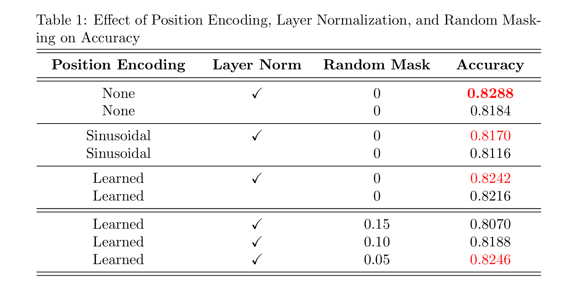

# Transformeer-DeepLaerning

This is a Deep Learning course (NTNU Laboratory Training Experiment) using PyTorch.

---

## Experiment Result
* comparsion with different position encoding type (sinusoidal, learned and w/o position encoding)
* comparsion with layernorm block and w/o layernorm block
* comparsion with differenet ratio of input mask

  

